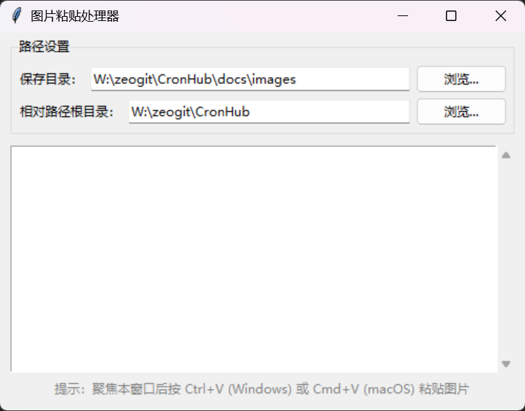

# 图片粘贴处理器使用手册

## 1. 简介

本工具可实现从`剪贴板捕获图片→自动保存→生成 Markdown 图片链接→复制回剪贴板`的完整流程。适用于技术文档编写、笔记记录等需要频繁插入图片的场景。

## 2. 使用指南

### 2.1. 界面说明



1. **路径设置区**  
   - 保存目录：存储截图的物理路径
   - 根目录：Markdown 相对路径的基准目录
2. **状态日志区**  
   实时显示操作结果和错误信息
3. **操作提示区**  
   显示当前可用快捷键

### 2.2. 基本功能

1. 启动程序
2. 配置保存目录和根目录（默认保存到`./zeoimg`目录下，根目录为`./`）

可以把窗口放在后台；当截图工具截取图片到剪切板后，切换并聚焦回程序窗口

1. 在程序窗口按下 **Ctrl+V (Windows)** 或 **Cmd+V (macOS)**
2. 程序将自动：
   - 保存图片到指定目录（默认`./zeoimg`）
   - 生成 Markdown 图片链接：``
   - 将链接复制到剪贴板

### 2.3. 路径生成规则

- 生成的 Markdown 路径基于根目录计算相对路径
- 若跨盘符保存会自动切换为绝对路径
- 文件名默认采用 `前缀+精确时间戳（精确到秒）`

## 3. 开发说明

```bash
pip install pillow pyperclip
# 或
uv init .
uv add pillow pyperclip
```

## 4. 高级配置

### 4.1. 自定义默认值

1. 修改 `DEFAULT_ROOT_DIR` `DEFAULT_SAVE_DIR` 可以修改默认保存路径
2. 修改 `FILE_PREFIX` 可以修改文件前缀
